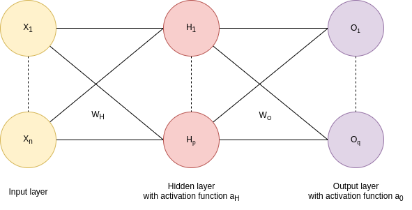

# Partial math explanation of Neural Networks

## How does a neural network makes its predictions ?

The objective of our model is to make predictions from data.

### The data

Let:

- $X \in \mathbb{R}^{n\times m}$ : the input data with $n$ features and $m$ observations
- $y \in \mathbb{R}^m$ : the labels of observations

### The neural network

Here we consider a simple NN constitued of 3 layers:

- the **Input layer** : namely the input data
- the **Hidden layer** with $p$ the size of the hidden layer
- the **Output layer** with $q$ the size of the output layer (ie possible values for prediction)

### The weights

The informations from the input layers are transmitted to the hidden layers with the weights $W_H$. This information is then passed throught an activation function : $H = a_H(X W_H)$. The same process is done with the output layer : $O = a_O(H W_O)$

- $W_H \in \mathbb{R}^{p\times n}$
- $W_O \in \mathbb{R}^{q\times p}$

With:

- $p$ : the hidden layer size
- $q$ : the output layer size (ie the number of classes)

### The bias

Adding bias to our neural network can help us shift the activation function to the left or right ; thus making it possible to make our model fit better to the data.

We therefore add a bias term to the hidden and output layer computation.

- $b_H \in \mathbb{R}^p$
- $b_O \in \mathbb{R}^q$

### Matrix formulation

Summing up all the above, we reach the following formulation:

$$\hat{y} = a_O(\underbrace{W_O \cdot \underbrace{a_H(\underbrace{W_H \cdot X + b_H)}_{Z_H \in \mathbb{{R}^{p \times m}}}}_{H \in \mathbb{R}^{p \times m}} + b_O}_{Z_O \in \mathbb{R}^{q \times m}})$$

This is known as forward propagation and is implemented in `forward_prop` method in [`diy_nn.py`](diy_nn.py).

## How does the NN learn ?

### Loss function

We used a softmax activation function for our output layer, the appropriate loss function to use is the Cross-Entropy:

$$\mathcal{L}(y, \hat{y}) = - \sum_{i=1}^q y_i\log(\hat{y}_i)$$

### Output error

The output error $E_O$ is the partial derivative of our loss function to $Z_O$:

$$E_O = \frac{\partial \mathcal{L}}{\partial Z_O} = \hat{y} - y$$

Where:

- $\hat{y} \in \mathbb{R}^{q \times m}$ is the predicted output of the model
- $y \in \mathbb{R}^{q \times m}$ is the one hot encoded real label (we must one hot encode each label to match $\hat{y}$ shape)

We do not enter further in the calculation of the partial derivatives.

### Hidden layer error

After that the backward propagation magic start to operate and we can compute the error on hidden layer:

$$E_H = W_O^T \cdot E_O * a_H'(Z_H)$$

Where $a_H'$ is the derivative of the activation function.

### Weights update

The weights are updated with the partial derivative of the loss function to the weights with a learning rate parameter ($lr$):

$$W_O = W_O - lr \underbrace{\left(\frac{1}{m}E_O \cdot H^T\right)}_{\frac{\partial \mathcal{J}}{\partial W_O}}$$
$$W_H = W_H - lr \underbrace{\left(\frac{1}{m}E_H \cdot X^T\right)}_{\frac{\partial \mathcal{J}}{\partial W_H}}$$

## Gradient descent

TODO
